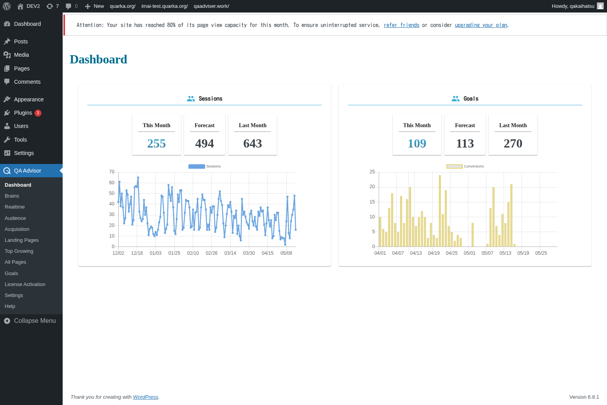

# Dashboard

## Overview
The Dashboard is the main overview screen of the QA Advisor plugin, providing a comprehensive summary of your website's analytics data. It serves as the central hub where you can quickly assess your site's performance, view key metrics, and access other plugin features.

## Accessing This Screen
1. Log in to your WordPress admin panel
2. Navigate to the left sidebar menu
3. Click on "QA Advisor"
4. Select "Dashboard" from the submenu (this is typically the default screen)

## Screen Layout

The Dashboard screen is organized into several key sections:
- **Header Area**: Contains navigation tabs and date range selectors
- **Key Metrics Cards**: Display important statistics like page views, visitors, and conversion rates
- **Charts and Graphs**: Visual representations of traffic trends and user behavior
- **Quick Actions**: Shortcuts to commonly used features and settings

## Features and Functions

### Key Performance Indicators
- **Purpose**: Provides at-a-glance view of your website's most important metrics
- **How to use**: Review the metric cards displayed prominently on the dashboard
- **Options**: Metrics typically include page views, unique visitors, bounce rate, and session duration
- **Tips**: Use these KPIs to quickly assess whether your site performance is trending up or down

### Date Range Selection
- **Purpose**: Allows you to view data for specific time periods
- **How to use**: Click on the date picker to select custom date ranges
- **Options**: Common presets include today, yesterday, last 7 days, last 30 days, and custom ranges
- **Tips**: Compare different time periods to identify trends and seasonal patterns

### Traffic Overview Chart
- **Purpose**: Visualizes visitor traffic patterns over time
- **How to use**: Hover over data points to see specific values for each day
- **Options**: Toggle between different metrics like page views, sessions, and unique visitors
- **Tips**: Look for spikes or dips that might correlate with marketing campaigns or site changes

## Common Tasks

### Checking Daily Performance
1. Access the Dashboard screen
2. Review the key metrics cards for today's performance
3. Compare with previous day or week using the date selector
4. Note any significant changes or trends

### Analyzing Traffic Trends
1. Use the date range selector to choose a longer period (e.g., last 30 days)
2. Examine the traffic overview chart for patterns
3. Identify peak traffic days and times
4. Look for correlation with your content publishing or marketing activities

### Quick Navigation to Detailed Reports
1. From the Dashboard, identify areas that need deeper analysis
2. Use the navigation menu to access specific reports (Audience, Acquisition, etc.)
3. Return to Dashboard for overall context when needed

## Settings and Configuration
The Dashboard screen itself has minimal configuration options, but you can:
- Customize the date range for default views
- Choose which metrics to display prominently
- Set up automated reports and alerts (if available)

## Troubleshooting

### No Data Showing
- **Issue**: Dashboard appears empty or shows no metrics
- **Solution**: Ensure the QA Advisor tracking code is properly installed on your website
- **Check**: Verify that you have sufficient data for the selected date range

### Slow Loading Dashboard
- **Issue**: Dashboard takes a long time to load
- **Solution**: Try selecting a shorter date range or clearing your browser cache
- **Check**: Ensure your hosting server has adequate resources

### Incorrect Data
- **Issue**: Metrics seem inaccurate or inconsistent
- **Solution**: Check your timezone settings and ensure tracking is not duplicated
- **Check**: Verify that filters or segments are not affecting the data display

## Related Documentation
- [Settings](/docs/user-manual/screens-and-operations/settings) - Configure general plugin settings
- [Realtime](/docs/user-manual/screens-and-operations/realtime) - View live visitor activity
- [Audience](/docs/user-manual/screens-and-operations/audience) - Detailed visitor demographics and behavior
