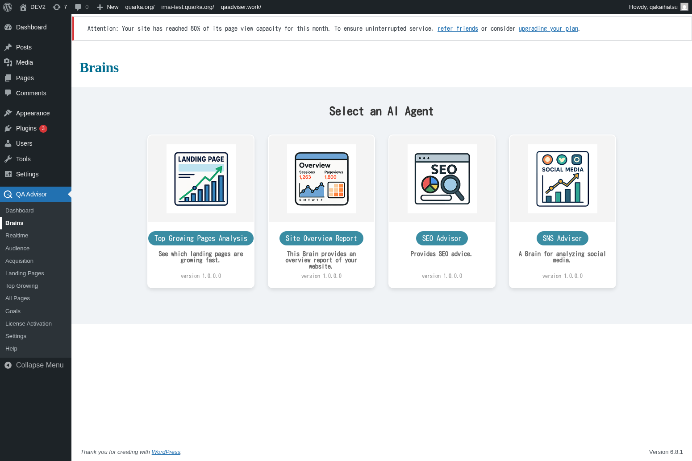

# Brains

## Overview
The Brains screen is QA Advisor's AI-powered analysis center that provides intelligent insights and recommendations based on your website's data. This feature uses machine learning algorithms to identify patterns, anomalies, and opportunities for optimization that might not be immediately obvious from raw analytics data.

## Accessing This Screen
1. Log in to your WordPress admin panel
2. Navigate to the left sidebar menu
3. Click on "QA Advisor"
4. Select "Brains" from the submenu

## Screen Layout

The Brains screen features:
- **AI Insights Panel**: Displays automated analysis and recommendations
- **Trend Analysis**: Shows detected patterns in your data
- **Anomaly Detection**: Highlights unusual spikes or drops in metrics
- **Optimization Suggestions**: AI-generated recommendations for improvement
- **Confidence Scores**: Indicates the reliability of each insight

## Features and Functions

### Automated Insights Generation
- **Purpose**: Automatically analyzes your data to surface important findings
- **How to use**: Review the insights panel for AI-generated observations
- **Options**: Insights cover traffic patterns, user behavior, and performance metrics
- **Tips**: Pay attention to insights with high confidence scores for actionable recommendations

### Trend Pattern Recognition
- **Purpose**: Identifies recurring patterns and seasonal trends in your data
- **How to use**: Examine the trend analysis section for detected patterns
- **Options**: View daily, weekly, or monthly trend patterns
- **Tips**: Use trend insights to plan content publishing and marketing campaigns

### Anomaly Detection
- **Purpose**: Automatically flags unusual changes in your website metrics
- **How to use**: Check the anomaly alerts for significant deviations from normal patterns
- **Options**: Set sensitivity levels for anomaly detection
- **Tips**: Investigate anomalies to understand their causes and take appropriate action

### Performance Optimization Recommendations
- **Purpose**: Provides AI-driven suggestions for improving website performance
- **How to use**: Review optimization recommendations and implement suggested changes
- **Options**: Recommendations may cover SEO, user experience, and conversion optimization
- **Tips**: Prioritize recommendations based on potential impact and implementation difficulty

## Common Tasks

### Reviewing Weekly AI Insights
1. Access the Brains screen at the beginning of each week
2. Read through the latest AI-generated insights
3. Note any significant patterns or anomalies detected
4. Create action items based on high-confidence recommendations

### Investigating Anomalies
1. Check the anomaly detection section for recent alerts
2. Click on specific anomalies to view detailed analysis
3. Cross-reference with your marketing activities or site changes
4. Document findings and take corrective action if needed

### Implementing AI Recommendations
1. Review the optimization suggestions panel
2. Evaluate each recommendation for feasibility and impact
3. Prioritize recommendations based on your business goals
4. Implement changes and monitor results in subsequent reports

## Settings and Configuration

### AI Analysis Preferences
- Configure which metrics the AI should focus on for analysis
- Set the frequency of automated insight generation
- Customize the types of recommendations you want to receive

### Anomaly Detection Settings
- Adjust sensitivity levels for anomaly detection
- Set thresholds for what constitutes significant changes
- Configure notification preferences for anomaly alerts

### Insight Categories
- Enable or disable specific categories of insights
- Customize the priority levels for different types of recommendations
- Set up automated reporting for AI insights

## Troubleshooting

### No AI Insights Available
- **Issue**: The Brains screen shows no insights or recommendations
- **Solution**: Ensure you have sufficient historical data (typically 30+ days)
- **Check**: Verify that AI analysis is enabled in your plugin settings

### Inaccurate Recommendations
- **Issue**: AI suggestions seem irrelevant or incorrect
- **Solution**: Review your data quality and ensure tracking is properly configured
- **Check**: Verify that your website goals and conversion tracking are set up correctly

### Slow AI Processing
- **Issue**: Insights take a long time to generate or update
- **Solution**: AI analysis requires significant processing time; check back later
- **Check**: Ensure your hosting environment meets the plugin's system requirements

## Related Documentation
- [Dashboard](./01-dashboard.md) - Main analytics overview
- [Goals](./09-goals.md) - Set up conversion tracking for better AI insights
- [Settings](./11-settings.md) - Configure AI analysis preferences
