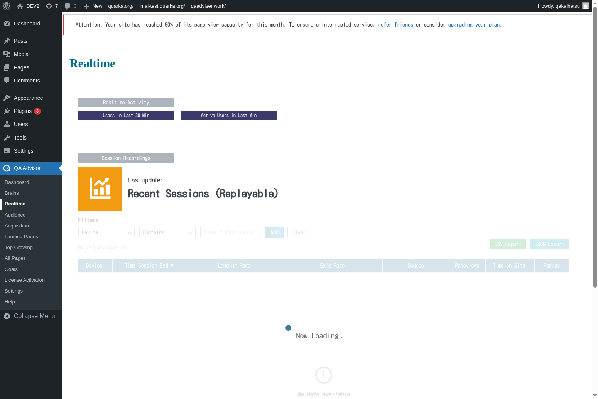

# Realtime

## Overview
The Realtime screen provides live monitoring of visitor activity on your website. This feature allows you to see what's happening on your site right now, including active visitors, page views, traffic sources, and user interactions as they occur in real-time.

## Accessing This Screen
1. Log in to your WordPress admin panel
2. Navigate to the left sidebar menu
3. Click on "QA Assistants"
4. Select "Realtime" from the submenu

## Screen Layout

The Realtime screen displays:
- **Active Visitors Counter**: Shows the current number of visitors on your site
- **Live Activity Feed**: Real-time stream of visitor actions and page views
- **Geographic Map**: Visual representation of visitor locations
- **Top Active Pages**: List of pages currently being viewed
- **Traffic Sources**: Real-time breakdown of how visitors are arriving
- **Device and Browser Information**: Live data about visitor technology

## Features and Functions

### Live Visitor Monitoring
- **Purpose**: Track the exact number of people currently browsing your website
- **How to use**: Monitor the active visitors counter for real-time engagement levels
- **Options**: View detailed information about each active session
- **Tips**: Use during marketing campaigns or content launches to gauge immediate response

### Real-time Activity Stream
- **Purpose**: See individual visitor actions as they happen on your site
- **How to use**: Watch the activity feed for page views, clicks, and interactions
- **Options**: Filter activities by page, visitor type, or action
- **Tips**: Identify popular content and user behavior patterns in real-time

### Geographic Visitor Tracking
- **Purpose**: Visualize where your current visitors are located geographically
- **How to use**: View the interactive map showing visitor locations
- **Options**: Zoom in on specific regions or countries
- **Tips**: Useful for understanding global reach and timing content for different time zones

### Live Page Performance
- **Purpose**: Monitor which pages are currently most popular
- **How to use**: Check the top active pages list to see current content performance
- **Options**: View detailed metrics for each active page
- **Tips**: Identify trending content and optimize high-traffic pages in real-time

## Common Tasks

### Monitoring Campaign Performance
1. Launch a marketing campaign or publish new content
2. Access the Realtime screen to monitor immediate response
3. Watch for spikes in active visitors and traffic sources
4. Track which pages are receiving the most attention

### Identifying Technical Issues
1. Monitor the realtime feed for unusual patterns or errors
2. Check if visitors are leaving specific pages quickly
3. Look for geographic patterns that might indicate technical problems
4. Use real-time data to quickly identify and resolve issues

### Content Performance Analysis
1. Publish new content or make site changes
2. Monitor real-time visitor behavior on affected pages
3. Track engagement metrics and user flow patterns
4. Make immediate adjustments based on real-time feedback

### Event and Launch Monitoring
1. During special events or product launches, keep the Realtime screen open
2. Monitor visitor spikes and geographic distribution
3. Track traffic sources to see which promotional channels are most effective
4. Respond quickly to unexpected traffic patterns or technical issues

## Settings and Configuration

### Real-time Data Refresh
- Set the frequency of data updates (typically every 5-30 seconds)
- Configure which metrics to display in real-time
- Customize the activity feed to show relevant actions

### Geographic Display Options
- Choose map style and zoom levels
- Set up geographic filters or focus areas
- Configure location tracking precision

### Activity Feed Filters
- Customize which visitor actions to display
- Set up filters for specific pages or user segments
- Configure notification thresholds for unusual activity

## Troubleshooting

### No Real-time Data
- **Issue**: Realtime screen shows no current visitors or activity
- **Solution**: Verify that tracking code is properly installed and functioning
- **Check**: Ensure your website has actual traffic and the data isn't being blocked

### Delayed Data Updates
- **Issue**: Real-time data appears to be delayed or not updating
- **Solution**: Check your internet connection and refresh the browser
- **Check**: Verify that JavaScript is enabled and not being blocked by ad blockers

### Inaccurate Visitor Count
- **Issue**: Active visitor count seems too high or too low
- **Solution**: Check for duplicate tracking codes or bot traffic filtering
- **Check**: Verify that session timeout settings are configured correctly

### Geographic Data Missing
- **Issue**: Visitor locations are not showing on the map
- **Solution**: Ensure geographic tracking is enabled in plugin settings
- **Check**: Verify that location services are not being blocked by privacy settings

## Related Documentation
- [Audience](/docs/user-manual/screens-and-operations/audience) - Detailed visitor demographics
- [Settings](/docs/user-manual/screens-and-operations/settings) - Configure real-time tracking options
