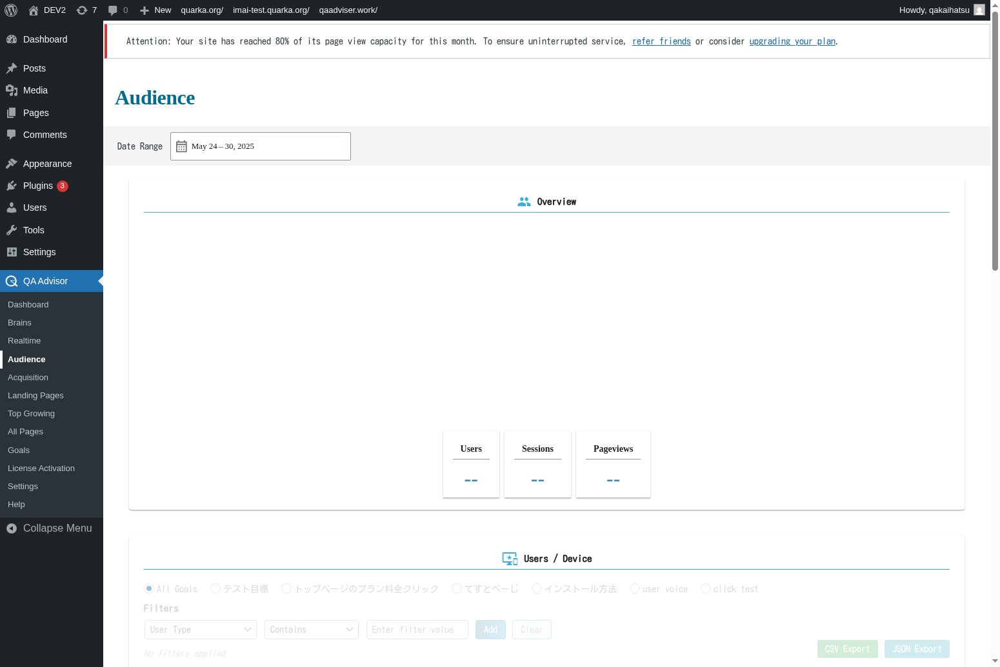

# Audience

## Overview
The Audience screen provides comprehensive insights into your website visitors' demographics, behavior patterns, and characteristics. This section helps you understand who your visitors are, how they interact with your site, and what devices and technologies they use to access your content.

## Accessing This Screen
1. Log in to your WordPress admin panel
2. Navigate to the left sidebar menu
3. Click on "QA Assistant"
4. Select "Audience" from the submenu

## Screen Layout

The Audience screen includes:
- **Visitor Demographics**: Age, gender, and geographic distribution
- **Technology Information**: Browsers, operating systems, and device types
- **Behavior Metrics**: Session duration, pages per session, and bounce rates
- **New vs. Returning Visitors**: Breakdown of visitor loyalty
- **Interest Categories**: Topics and categories that interest your audience
- **User Flow Visualization**: How visitors navigate through your site

## Features and Functions

### Demographic Analysis
- **Purpose**: Understand the age, gender, and location distribution of your audience
- **How to use**: Review demographic charts and maps to identify your primary audience segments
- **Options**: Filter by date ranges, geographic regions, or visitor segments
- **Tips**: Use demographic data to tailor content and marketing strategies to your audience

### Technology and Device Insights
- **Purpose**: Analyze what devices, browsers, and operating systems your visitors use
- **How to use**: Check technology reports to ensure your site is optimized for your audience's preferences
- **Options**: View detailed breakdowns by device category, browser version, and screen resolution
- **Tips**: Prioritize mobile optimization if mobile traffic is significant

### Behavioral Patterns
- **Purpose**: Understand how visitors interact with your website
- **How to use**: Analyze session duration, pages per visit, and bounce rates
- **Options**: Segment data by visitor type, traffic source, or content category
- **Tips**: High bounce rates may indicate content or user experience issues

### Visitor Loyalty Analysis
- **Purpose**: Track the ratio of new visitors to returning visitors
- **How to use**: Monitor the new vs. returning visitor chart to assess audience retention
- **Options**: View loyalty trends over time and by traffic source
- **Tips**: A healthy mix includes both new visitor acquisition and returning visitor retention

## Common Tasks

### Analyzing Audience Demographics
1. Access the Audience screen and review demographic data
2. Identify your primary audience segments by age, gender, and location
3. Compare demographic trends over different time periods
4. Use insights to inform content strategy and marketing targeting

### Optimizing for Device Usage
1. Review the technology section to understand device preferences
2. Check mobile vs. desktop usage patterns
3. Analyze browser and operating system distributions
4. Ensure your website is optimized for the most common configurations

### Improving User Engagement
1. Examine behavioral metrics like session duration and pages per session
2. Identify pages with high bounce rates
3. Analyze user flow patterns to understand navigation preferences
4. Make improvements based on behavioral insights

### Tracking Audience Growth
1. Monitor new vs. returning visitor ratios over time
2. Analyze which traffic sources bring the most engaged visitors
3. Track changes in audience demographics and interests
4. Adjust marketing strategies based on audience evolution

## Settings and Configuration

### Demographic Tracking
- Enable or disable demographic data collection
- Configure privacy settings for demographic information
- Set up custom audience segments for analysis

### Technology Reporting
- Customize device and browser categorization
- Set up alerts for significant technology usage changes
- Configure detailed vs. simplified technology reporting

### Behavioral Analysis
- Define custom events and interactions to track
- Set up goal funnels to analyze user journeys
- Configure session timeout and engagement thresholds

## Troubleshooting

### Missing Demographic Data
- **Issue**: Demographic information is not available or incomplete
- **Solution**: Ensure demographic tracking is enabled and complies with privacy regulations
- **Check**: Verify that sufficient data volume exists for demographic analysis

### Inaccurate Device Detection
- **Issue**: Device or browser information appears incorrect
- **Solution**: Update the plugin to the latest version for improved device detection
- **Check**: Verify that user agent strings are being properly parsed

### Low Engagement Metrics
- **Issue**: Session duration and pages per session are lower than expected
- **Solution**: Analyze user flow and identify potential barriers to engagement
- **Check**: Review site speed, content quality, and navigation structure

### Geographic Data Issues
- **Issue**: Visitor locations are inaccurate or missing
- **Solution**: Check IP geolocation database updates and privacy settings
- **Check**: Ensure that VPN and proxy traffic is being handled appropriately

## Related Documentation
- [Acquisition](/docs/user-manual/screens-and-operations/acquisition) - How visitors find your site
- [All Pages](/docs/user-manual/screens-and-operations/all-pages) - Content performance analysis
- [Settings](/docs/user-manual/screens-and-operations/settings) - Configure audience tracking options
