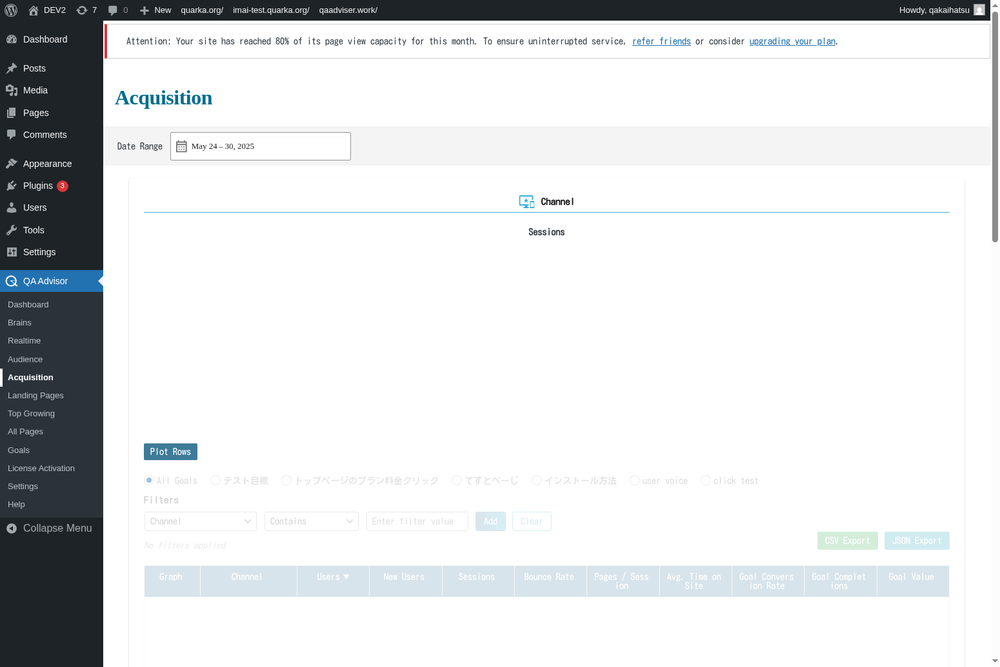

# Acquisition

## Overview
The Acquisition screen shows you how visitors find and arrive at your website. This section provides detailed insights into your traffic sources, including search engines, social media, direct visits, referral sites, and marketing campaigns, helping you understand which channels are most effective for driving traffic.

## Accessing This Screen
1. Log in to your WordPress admin panel
2. Navigate to the left sidebar menu
3. Click on "QA Assistants"
4. Select "Acquisition" from the submenu

## Screen Layout

The Acquisition screen displays:
- **Traffic Source Overview**: Pie chart showing the distribution of traffic sources
- **Channel Performance**: Detailed metrics for each acquisition channel
- **Search Engine Analysis**: Organic and paid search traffic breakdown
- **Social Media Traffic**: Visits from various social platforms
- **Referral Sources**: Traffic from other websites linking to yours
- **Campaign Tracking**: Performance of marketing campaigns with UTM parameters

## Features and Functions

### Traffic Source Analysis
- **Purpose**: Understand which channels drive the most visitors to your site
- **How to use**: Review the traffic source breakdown to identify your most valuable channels
- **Options**: View data by sessions, users, page views, or conversion metrics
- **Tips**: Focus marketing efforts on channels that provide the highest quality traffic

### Search Engine Performance
- **Purpose**: Analyze organic and paid search traffic effectiveness
- **How to use**: Compare performance between different search engines and keywords
- **Options**: View organic vs. paid search breakdowns and keyword performance
- **Tips**: Use search data to inform SEO strategy and paid advertising decisions

### Social Media Analytics
- **Purpose**: Track traffic and engagement from social media platforms
- **How to use**: Monitor which social platforms drive the most engaged visitors
- **Options**: Compare performance across different social networks
- **Tips**: Invest more time in social platforms that generate quality traffic and conversions

### Referral Traffic Monitoring
- **Purpose**: Identify websites that link to and drive traffic to your site
- **How to use**: Review referral sources to understand your link profile and partnerships
- **Options**: Analyze referral quality and visitor behavior from different sources
- **Tips**: Build relationships with high-quality referral sources and monitor for spam traffic

## Common Tasks

### Evaluating Marketing Channel Performance
1. Access the Acquisition screen and review the traffic source overview
2. Compare performance metrics across different channels
3. Identify which sources provide the highest conversion rates
4. Allocate marketing budget based on channel effectiveness

### Analyzing Search Traffic
1. Review organic search performance and trending keywords
2. Compare organic vs. paid search effectiveness
3. Identify opportunities for SEO improvement
4. Monitor search engine algorithm impact on traffic

### Tracking Campaign Effectiveness
1. Set up UTM parameters for marketing campaigns
2. Monitor campaign performance in the acquisition reports
3. Compare different campaign strategies and channels
4. Calculate return on investment for marketing activities

### Identifying Growth Opportunities
1. Analyze underperforming channels for improvement potential
2. Look for new referral sources and partnership opportunities
3. Monitor competitor traffic sources and strategies
4. Test new acquisition channels and measure results

## Settings and Configuration

### Traffic Source Classification
- Customize how different traffic sources are categorized
- Set up rules for classifying unknown or miscategorized traffic
- Configure organic search engine recognition

### Campaign Tracking
- Set up automatic UTM parameter tracking
- Configure campaign naming conventions
- Enable cross-domain tracking for multi-site campaigns

### Referral Filtering
- Set up filters to exclude internal traffic and spam referrals
- Configure referral exclusion lists
- Enable or disable specific referral tracking features

## Troubleshooting

### Missing Traffic Source Data
- **Issue**: Some traffic appears as "Direct" when it should be attributed to other sources
- **Solution**: Check UTM parameter implementation and referral header preservation
- **Check**: Verify that HTTPS redirects and cross-domain tracking are properly configured

### Inaccurate Search Engine Attribution
- **Issue**: Search traffic is not being properly attributed to specific search engines
- **Solution**: Update search engine recognition rules and check for SSL search encryption
- **Check**: Ensure that organic search detection is working for all major search engines

### Spam Referral Traffic
- **Issue**: Acquisition reports show suspicious or spam referral traffic
- **Solution**: Implement referral spam filters and exclude known spam domains
- **Check**: Review referral exclusion lists and update filtering rules regularly

### Campaign Tracking Issues
- **Issue**: Marketing campaigns are not showing up in acquisition reports
- **Solution**: Verify UTM parameter implementation and campaign URL structure
- **Check**: Ensure that campaign parameters are properly formatted and not being stripped

## Related Documentation
- [Landing Pages](/docs/user-manual/screens-and-operations/landing-pages) - Entry point performance
- [Goals](/docs/user-manual/screens-and-operations/goals) - Conversion tracking by traffic source
- [Settings](/docs/user-manual/screens-and-operations/settings) - Configure acquisition tracking settings
