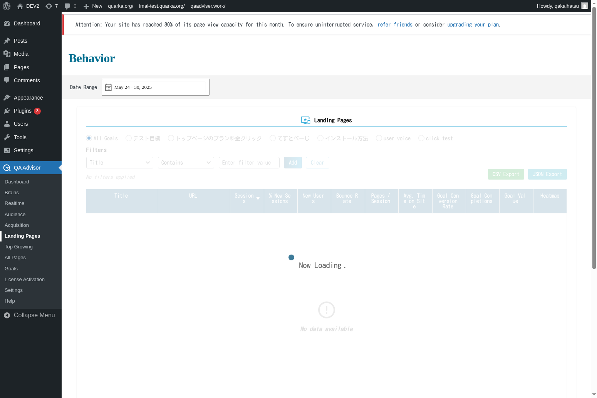

# Landing Pages

## Overview
The Landing Pages screen provides detailed analysis of the pages where visitors first enter your website. This section helps you understand which pages are most effective at attracting visitors, how well they engage users, and which landing pages contribute most to your conversion goals.

## Accessing This Screen
1. Log in to your WordPress admin panel
2. Navigate to the left sidebar menu
3. Click on "QA Assistants"
4. Select "Landing Pages" from the submenu

## Screen Layout

The Landing Pages screen features:
- **Top Landing Pages List**: Ranked list of your most popular entry points
- **Performance Metrics**: Bounce rate, session duration, and conversion data for each page
- **Traffic Source Breakdown**: How visitors arrive at each landing page
- **Conversion Funnel**: Path from landing page to goal completion
- **Page Performance Trends**: Historical data showing landing page effectiveness over time
- **Mobile vs. Desktop Performance**: Device-specific landing page metrics

## Features and Functions

### Landing Page Performance Analysis
- **Purpose**: Identify which pages are most effective at attracting and engaging visitors
- **How to use**: Review the performance metrics for each landing page
- **Options**: Sort by sessions, bounce rate, conversion rate, or revenue
- **Tips**: Focus optimization efforts on high-traffic pages with improvement potential

### Bounce Rate Optimization
- **Purpose**: Understand why visitors leave after viewing only one page
- **How to use**: Identify landing pages with high bounce rates and analyze potential causes
- **Options**: Compare bounce rates across different traffic sources and devices
- **Tips**: High bounce rates may indicate content mismatch or poor user experience

### Conversion Path Analysis
- **Purpose**: Track how landing pages contribute to goal completions and conversions
- **How to use**: Analyze the conversion funnel from landing page to final goal
- **Options**: View conversion rates by landing page and traffic source
- **Tips**: Optimize high-traffic landing pages to improve overall conversion rates

### Traffic Source Attribution
- **Purpose**: Understand how different traffic sources perform on various landing pages
- **How to use**: Review which traffic sources drive the most valuable visitors to each page
- **Options**: Filter by organic search, paid ads, social media, or referrals
- **Tips**: Tailor landing page content to match visitor expectations from different sources

## Common Tasks

### Identifying Top Performing Landing Pages
1. Access the Landing Pages screen and review the top pages list
2. Sort by relevant metrics like sessions, conversion rate, or revenue
3. Identify patterns among your best-performing landing pages
4. Apply successful elements to other pages

### Optimizing High-Bounce Pages
1. Identify landing pages with bounce rates above your site average
2. Analyze the content, design, and user experience of these pages
3. Check if the page content matches visitor expectations from traffic sources
4. Implement improvements and monitor bounce rate changes

### Improving Conversion Funnels
1. Review conversion rates for your top landing pages
2. Analyze the path visitors take from landing page to conversion
3. Identify drop-off points in the conversion funnel
4. Optimize page elements to guide visitors toward goals

### Analyzing Mobile Landing Page Performance
1. Compare mobile vs. desktop performance for key landing pages
2. Identify pages that perform poorly on mobile devices
3. Check mobile page speed and user experience
4. Implement mobile-specific optimizations

## Settings and Configuration

### Landing Page Tracking
- Configure which pages should be considered as potential landing pages
- Set up custom landing page categories or groups
- Enable enhanced landing page attribution

### Performance Thresholds
- Set benchmark values for bounce rate, session duration, and conversion rate
- Configure alerts for significant performance changes
- Customize performance scoring algorithms

### Conversion Attribution
- Set up goal tracking for landing page analysis
- Configure multi-channel attribution models
- Enable e-commerce tracking for revenue attribution

## Troubleshooting

### Inaccurate Landing Page Data
- **Issue**: Landing page reports show unexpected or missing pages
- **Solution**: Verify that page tracking is properly implemented across all site pages
- **Check**: Ensure that redirects and canonical URLs are not affecting landing page attribution

### High Bounce Rates Across All Pages
- **Issue**: Most landing pages show unusually high bounce rates
- **Solution**: Check site speed, mobile responsiveness, and content relevance
- **Check**: Verify that bounce rate calculation is configured correctly

### Missing Conversion Data
- **Issue**: Landing pages show traffic but no conversion information
- **Solution**: Ensure that goal tracking and conversion events are properly set up
- **Check**: Verify that conversion tracking code is installed on relevant pages

### Inconsistent Traffic Source Attribution
- **Issue**: Traffic sources for landing pages don't match acquisition reports
- **Solution**: Check UTM parameter implementation and referral tracking
- **Check**: Ensure that traffic source attribution is consistent across all reports

## Related Documentation
- [Acquisition](/docs/user-manual/screens-and-operations/acquisition) - Traffic source analysis
- [All Pages](/docs/user-manual/screens-and-operations/all-pages) - Comprehensive page performance
- [Goals](/docs/user-manual/screens-and-operations/goals) - Conversion tracking setup
- [Settings](/docs/user-manual/screens-and-operations/settings) - Configure landing page tracking options
