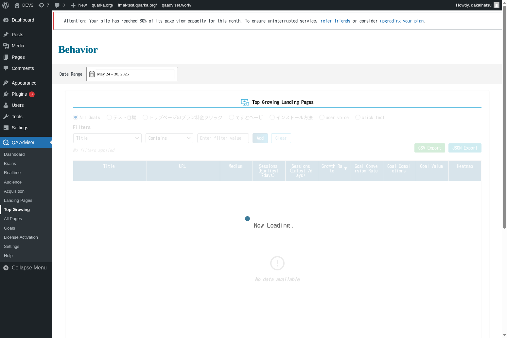

# Top Growing

## Overview
The Top Growing screen identifies pages and content on your website that are experiencing the fastest growth in traffic, engagement, or conversions. This feature helps you spot trending content, capitalize on viral opportunities, and understand what resonates most with your audience.

## Accessing This Screen
1. Log in to your WordPress admin panel
2. Navigate to the left sidebar menu
3. Click on "QA Assistant"
4. Select "Top Growing" from the submenu

## Screen Layout

The Top Growing screen displays:
- **Growth Rate Rankings**: Pages ranked by percentage increase in key metrics
- **Trending Content List**: Content showing significant upward trends
- **Growth Metrics Comparison**: Before and after statistics for growing pages
- **Time Period Selector**: Choose the timeframe for growth analysis
- **Growth Categories**: Different types of growth (traffic, engagement, conversions)
- **Trend Visualization**: Charts showing growth patterns over time

## Features and Functions

### Growth Rate Analysis
- **Purpose**: Identify content experiencing rapid increases in performance
- **How to use**: Review the growth rate rankings to find your fastest-growing pages
- **Options**: Sort by traffic growth, engagement growth, or conversion growth
- **Tips**: Focus on pages with sustained growth rather than one-time spikes

### Trending Content Detection
- **Purpose**: Spot content that's gaining momentum and viral potential
- **How to use**: Monitor the trending content list for emerging popular topics
- **Options**: Filter by content type, category, or publication date
- **Tips**: Capitalize on trending content by creating related or follow-up content

### Growth Pattern Visualization
- **Purpose**: Understand the trajectory and sustainability of content growth
- **How to use**: Examine growth charts to distinguish between temporary spikes and sustained trends
- **Options**: View daily, weekly, or monthly growth patterns
- **Tips**: Look for consistent upward trends rather than volatile fluctuations

### Comparative Growth Analysis
- **Purpose**: Compare growth rates across different pages and time periods
- **How to use**: Use the comparison tools to benchmark growth performance
- **Options**: Compare similar content types or pages from different time periods
- **Tips**: Identify common factors among your fastest-growing content

## Common Tasks

### Identifying Viral Content Opportunities
1. Access the Top Growing screen and review recent growth leaders
2. Analyze what makes these pages successful
3. Look for common themes, topics, or formats
4. Create similar content to capitalize on trends

### Optimizing Growing Pages
1. Identify pages with strong growth potential
2. Review these pages for optimization opportunities
3. Improve SEO, user experience, or conversion elements
4. Monitor continued growth after optimizations

### Content Strategy Planning
1. Analyze which types of content show the most consistent growth
2. Identify seasonal or trending topics in your niche
3. Plan future content based on growth patterns
4. Allocate resources to content types with highest growth potential

### Performance Monitoring
1. Set up alerts for pages showing significant growth
2. Monitor growth sustainability over time
3. Track whether growth translates to conversions
4. Adjust marketing efforts to support growing content

## Settings and Configuration

### Growth Calculation Settings
- Configure the time periods used for growth calculations
- Set minimum thresholds for what constitutes significant growth
- Choose which metrics to include in growth analysis

### Trending Detection
- Adjust sensitivity for trend detection algorithms
- Set up automated alerts for rapidly growing content
- Configure notification preferences for growth milestones

### Content Categorization
- Set up custom content categories for growth analysis
- Configure content tagging for better trend identification
- Enable automatic content classification

## Troubleshooting

### No Growing Content Detected
- **Issue**: The Top Growing screen shows no trending or growing pages
- **Solution**: Ensure you have sufficient historical data and recent content
- **Check**: Verify that growth thresholds are set appropriately for your site size

### Inaccurate Growth Calculations
- **Issue**: Growth percentages seem incorrect or unrealistic
- **Solution**: Check the baseline data and ensure tracking has been consistent
- **Check**: Verify that there are no data collection gaps or tracking issues

### Temporary Spikes Showing as Growth
- **Issue**: One-time traffic spikes are being classified as sustained growth
- **Solution**: Adjust the time period settings to require longer-term growth patterns
- **Check**: Review growth calculation algorithms and smoothing parameters

### Missing Recent Content
- **Issue**: Recently published content doesn't appear in growth analysis
- **Solution**: Allow sufficient time for data collection and trend establishment
- **Check**: Ensure that new content is being properly tracked and indexed

## Related Documentation
- [All Pages](/docs/user-manual/screens-and-operations/all-pages) - Comprehensive page performance analysis
- [Settings](/docs/user-manual/screens-and-operations/settings) - Configure growth tracking parameters
