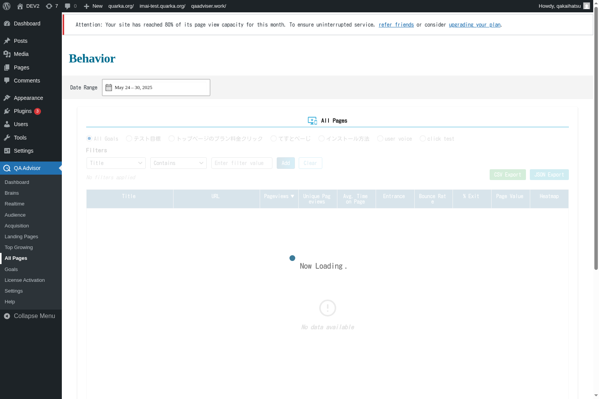

# All Pages

## Overview
The All Pages screen provides a comprehensive overview of every page on your website, displaying detailed performance metrics, traffic data, and user engagement statistics. This section serves as your complete content inventory and performance dashboard, allowing you to analyze and optimize individual pages across your entire site.

## Accessing This Screen
1. Log in to your WordPress admin panel
2. Navigate to the left sidebar menu
3. Click on "QA Advisor"
4. Select "All Pages" from the submenu

## Screen Layout

The All Pages screen includes:
- **Page Inventory Table**: Complete list of all tracked pages with key metrics
- **Performance Filters**: Tools to sort and filter pages by various criteria
- **Bulk Actions**: Options to perform actions on multiple pages simultaneously
- **Page Details Panel**: Detailed metrics for individual pages when selected
- **Export Options**: Tools to export page data for external analysis
- **Search and Filter Bar**: Quick access to find specific pages or content types

## Features and Functions

### Comprehensive Page Listing
- **Purpose**: View all pages on your website with their performance metrics in one place
- **How to use**: Browse the complete page inventory table to assess overall content performance
- **Options**: Sort by page views, bounce rate, conversion rate, or other metrics
- **Tips**: Use this view to identify both high-performing and underperforming content

### Advanced Filtering and Sorting
- **Purpose**: Quickly find specific pages or groups of pages based on performance criteria
- **How to use**: Use filters to narrow down pages by traffic, engagement, or content type
- **Options**: Filter by date range, page type, traffic source, or custom segments
- **Tips**: Create custom filters to regularly monitor specific page categories

### Individual Page Analysis
- **Purpose**: Get detailed insights into specific page performance
- **How to use**: Click on any page to view comprehensive metrics and trends
- **Options**: View traffic patterns, user behavior, and conversion data for individual pages
- **Tips**: Use individual page analysis to understand what makes certain pages successful

### Bulk Page Management
- **Purpose**: Perform actions on multiple pages simultaneously
- **How to use**: Select multiple pages and apply bulk actions like tagging or categorization
- **Options**: Bulk edit page properties, apply tags, or export selected page data
- **Tips**: Use bulk actions to efficiently manage large content inventories

## Common Tasks

### Content Performance Audit
1. Access the All Pages screen and review the complete page inventory
2. Sort pages by key performance metrics like page views or bounce rate
3. Identify top-performing and underperforming content
4. Create action plans for content optimization or removal

### Finding Optimization Opportunities
1. Filter pages by low engagement metrics or high bounce rates
2. Analyze common characteristics of underperforming pages
3. Identify pages with high traffic but low conversions
4. Prioritize optimization efforts based on traffic and potential impact

### Content Inventory Management
1. Use the search function to find specific pages or content types
2. Apply tags or categories to organize your content inventory
3. Track content publication dates and update frequencies
4. Identify outdated content that needs refreshing or removal

### Performance Benchmarking
1. Compare page performance across different content types or categories
2. Identify your best-performing pages and analyze success factors
3. Set performance benchmarks based on your top content
4. Monitor how new content performs against established benchmarks

## Settings and Configuration

### Page Tracking Settings
- Configure which pages should be included in the All Pages report
- Set up custom page categorization and tagging systems
- Enable or disable tracking for specific page types

### Metric Display Options
- Customize which metrics are displayed in the page inventory table
- Set up custom calculated metrics and performance indicators
- Configure default sorting and filtering preferences

### Data Export Settings
- Set up automated page performance reports
- Configure export formats and data inclusion options
- Enable scheduled exports for regular content audits

## Troubleshooting

### Missing Pages in Inventory
- **Issue**: Some website pages don't appear in the All Pages list
- **Solution**: Verify that tracking code is installed on all pages and check for exclusion filters
- **Check**: Ensure that new pages have sufficient data collection time

### Inaccurate Page Metrics
- **Issue**: Page performance data seems incorrect or inconsistent
- **Solution**: Check for duplicate tracking codes or data collection issues
- **Check**: Verify that page URLs are being tracked consistently without variations

### Slow Loading Page List
- **Issue**: The All Pages screen takes a long time to load or becomes unresponsive
- **Solution**: Reduce the date range or apply filters to limit the data set
- **Check**: Ensure your hosting environment can handle large data queries

### Export Function Not Working
- **Issue**: Page data export fails or produces incomplete files
- **Solution**: Check file permissions and available disk space
- **Check**: Verify that the export format is supported and data size is within limits

## Related Documentation
- [Dashboard](./01-dashboard.md) - Overall site performance overview
- [Landing Pages](./06-landing-pages.md) - Entry point analysis
- [Top Growing](./07-top-growing.md) - Trending content identification
- [Settings](./11-settings.md) - Configure page tracking and display options
