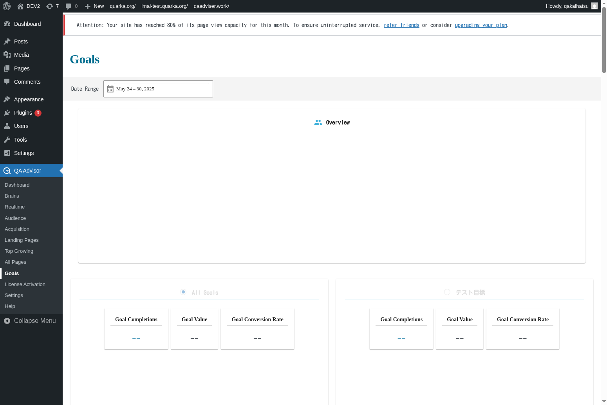

# Goals

## Overview
The Goals screen allows you to set up, monitor, and analyze conversion tracking for your website. This feature helps you measure how well your site achieves specific business objectives, such as form submissions, purchases, newsletter signups, or any other valuable user actions you want to track.

## Accessing This Screen
1. Log in to your WordPress admin panel
2. Navigate to the left sidebar menu
3. Click on "QA Advisor"
4. Select "Goals" from the submenu

## Screen Layout

The Goals screen features:
- **Goal Setup Wizard**: Step-by-step interface for creating new goals
- **Active Goals List**: Overview of all configured goals with performance metrics
- **Conversion Funnel Visualization**: Visual representation of goal completion paths
- **Goal Performance Charts**: Trends and patterns in goal completion over time
- **Attribution Analysis**: Understanding which traffic sources drive conversions
- **Goal Value Tracking**: Revenue or value attribution for completed goals

## Features and Functions

### Goal Configuration
- **Purpose**: Set up tracking for specific user actions that matter to your business
- **How to use**: Use the goal setup wizard to define conversion events and conditions
- **Options**: Track page visits, form submissions, downloads, purchases, or custom events
- **Tips**: Start with your most important business objectives and add more goals gradually

### Conversion Tracking
- **Purpose**: Monitor how many visitors complete your defined goals
- **How to use**: Review conversion rates and completion numbers for each goal
- **Options**: View conversions by time period, traffic source, or user segment
- **Tips**: Set realistic conversion rate benchmarks based on your industry and content type

### Funnel Analysis
- **Purpose**: Understand the path visitors take to complete goals
- **How to use**: Analyze the conversion funnel to identify drop-off points
- **Options**: Set up multi-step funnels with intermediate checkpoints
- **Tips**: Optimize pages with high drop-off rates to improve overall conversion rates

### Goal Value Assignment
- **Purpose**: Assign monetary or point values to goal completions
- **How to use**: Set up goal values to calculate return on investment for marketing efforts
- **Options**: Use fixed values, dynamic values, or custom calculation methods
- **Tips**: Assign realistic values that reflect the actual business impact of each conversion

## Common Tasks

### Setting Up Your First Goal
1. Access the Goals screen and click "Create New Goal"
2. Choose a goal type (destination, duration, pages per session, or event)
3. Define the specific conditions that constitute a goal completion
4. Set a goal value if applicable and save the configuration
5. Test the goal to ensure it's tracking correctly

### Analyzing Goal Performance
1. Review the active goals list to see conversion rates and completion numbers
2. Identify goals with low conversion rates that need optimization
3. Analyze trends over time to understand seasonal patterns
4. Compare goal performance across different traffic sources

### Optimizing Conversion Funnels
1. Set up funnel visualization for multi-step conversion processes
2. Identify steps in the funnel with high abandonment rates
3. Analyze user behavior at each funnel step
4. Implement improvements to reduce drop-offs and increase completions

### Measuring Marketing ROI
1. Assign appropriate values to each goal based on business impact
2. Track goal completions by traffic source and campaign
3. Calculate return on investment for different marketing channels
4. Adjust marketing spend based on goal completion data

## Settings and Configuration

### Goal Types and Triggers
- Configure different types of goals (destination, duration, pages, events)
- Set up custom event tracking for specific user interactions
- Define goal completion conditions and requirements

### Funnel Configuration
- Set up multi-step conversion funnels with intermediate steps
- Configure funnel visualization and analysis options
- Enable or disable funnel requirement settings

### Attribution Settings
- Choose attribution models for goal completion credit
- Configure lookback windows for conversion attribution
- Set up cross-device and cross-session tracking

### Value and Revenue Tracking
- Set up goal values and revenue tracking
- Configure dynamic value calculation methods
- Enable e-commerce integration for purchase tracking

## Troubleshooting

### Goals Not Tracking
- **Issue**: Goal completions are not being recorded
- **Solution**: Verify that goal conditions are correctly configured and tracking code is properly installed
- **Check**: Test goal completion manually and check for JavaScript errors

### Inaccurate Conversion Data
- **Issue**: Goal completion numbers seem too high or too low
- **Solution**: Review goal conditions for accuracy and check for duplicate tracking
- **Check**: Verify that goal triggers are firing only when intended

### Funnel Data Missing
- **Issue**: Conversion funnel shows incomplete or missing data
- **Solution**: Ensure all funnel steps have proper tracking and sufficient traffic
- **Check**: Verify that funnel step URLs and conditions are correctly configured

### Attribution Issues
- **Issue**: Goal completions are not properly attributed to traffic sources
- **Solution**: Check attribution model settings and cross-domain tracking configuration
- **Check**: Verify that UTM parameters and referral data are being preserved

## Related Documentation
- [Dashboard](/docs/user-manual/screens-and-operations/dashboard) - Overall conversion performance
- [Acquisition](/docs/user-manual/screens-and-operations/acquisition) - Traffic source conversion analysis
- [Landing Pages](/docs/user-manual/screens-and-operations/landing-pages) - Entry point conversion optimization
- [Settings](/docs/user-manual/screens-and-operations/settings) - Configure goal tracking preferences
