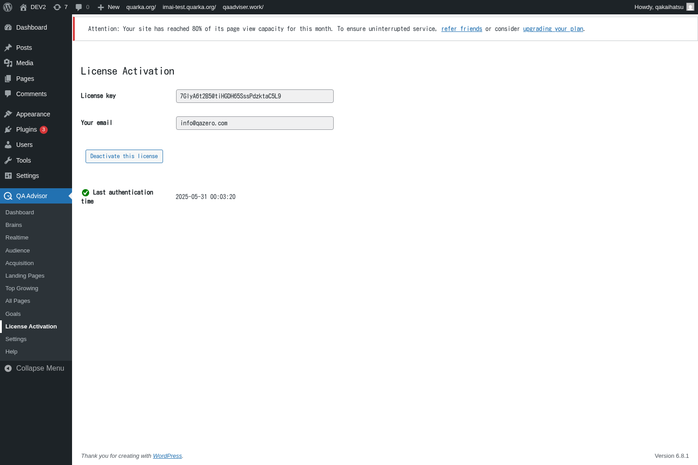

# License Activation

## Overview
The License Activation screen manages your QA Advisor plugin license, ensuring you have access to all premium features and receive regular updates. This section handles license validation, activation status, and provides information about your subscription plan and usage limits.

## Accessing This Screen
1. Log in to your WordPress admin panel
2. Navigate to the left sidebar menu
3. Click on "QA Advisor"
4. Select "License Activation" from the submenu

## Screen Layout

The License Activation screen displays:
- **License Status Indicator**: Current activation status and validity
- **License Key Input Field**: Where you enter your purchased license key
- **Subscription Information**: Details about your current plan and features
- **Usage Statistics**: Current usage against plan limits
- **Renewal Information**: Subscription expiration date and renewal options
- **Support and Documentation Links**: Quick access to help resources

## Features and Functions

### License Key Management
- **Purpose**: Activate and manage your QA Advisor plugin license
- **How to use**: Enter your license key in the provided field and click activate
- **Options**: Activate new licenses, deactivate for site transfers, or update existing keys
- **Tips**: Keep your license key secure and only use it on authorized domains

### Subscription Status Monitoring
- **Purpose**: Track your current subscription plan and remaining benefits
- **How to use**: Review subscription details to understand available features and limits
- **Options**: View plan details, usage statistics, and feature availability
- **Tips**: Monitor usage to ensure you stay within plan limits and avoid service interruptions

### License Validation
- **Purpose**: Verify that your license is valid and properly activated
- **How to use**: The system automatically validates your license and displays status
- **Options**: Manual validation, automatic checks, and troubleshooting tools
- **Tips**: Regular validation ensures continued access to updates and support

### Domain Authorization
- **Purpose**: Manage which domains are authorized to use your license
- **How to use**: View and manage the domains associated with your license
- **Options**: Add new domains, remove old ones, or transfer licenses between sites
- **Tips**: Deactivate licenses on old domains before activating on new ones

## Common Tasks

### Activating a New License
1. Purchase a QA Advisor license from the official website
2. Access the License Activation screen in your WordPress admin
3. Enter your license key in the provided field
4. Click "Activate License" and wait for confirmation
5. Verify that all premium features are now available

### Checking License Status
1. Navigate to the License Activation screen
2. Review the license status indicator for current activation state
3. Check subscription expiration date and renewal requirements
4. Monitor usage statistics against your plan limits

### Transferring License to New Domain
1. Access the License Activation screen on your current site
2. Click "Deactivate License" to free up the license slot
3. Install QA Advisor on your new domain
4. Enter the same license key and activate on the new site
5. Verify that the transfer was successful

### Troubleshooting License Issues
1. Check that your license key is entered correctly without extra spaces
2. Verify that your domain is authorized for the license
3. Ensure your subscription is current and not expired
4. Contact support if activation continues to fail

## Settings and Configuration

### Automatic License Validation
- Enable or disable automatic license checking
- Set frequency for license validation checks
- Configure notification preferences for license issues

### Domain Management
- View and manage authorized domains for your license
- Set up automatic domain detection and authorization
- Configure domain transfer and migration options

### Usage Monitoring
- Set up alerts for approaching usage limits
- Configure usage reporting and notifications
- Enable detailed usage tracking and analytics

## Troubleshooting

### License Activation Failed
- **Issue**: License key is rejected or activation fails
- **Solution**: Verify the license key is correct and your subscription is active
- **Check**: Ensure you haven't exceeded the number of allowed activations

### License Expired or Invalid
- **Issue**: Previously working license shows as expired or invalid
- **Solution**: Check your subscription status and renew if necessary
- **Check**: Verify that your payment method is current and subscription is active

### Features Not Available After Activation
- **Issue**: Premium features are not accessible despite valid license
- **Solution**: Clear plugin cache and refresh the page, or deactivate and reactivate the plugin
- **Check**: Verify that the license includes the features you're trying to access

### Domain Authorization Issues
- **Issue**: License works on some domains but not others
- **Solution**: Check that all domains are properly authorized in your license account
- **Check**: Verify that you haven't exceeded the number of allowed domains

### Connection Problems
- **Issue**: License validation fails due to connection errors
- **Solution**: Check your server's internet connection and firewall settings
- **Check**: Ensure that your hosting provider allows outbound connections to license servers

## Related Documentation
- [Settings](/docs/user-manual/screens-and-operations/settings) - General plugin configuration
- [Help](/docs/user-manual/screens-and-operations/help) - Support and troubleshooting resources
- [Dashboard](/docs/user-manual/screens-and-operations/dashboard) - Access premium dashboard features
