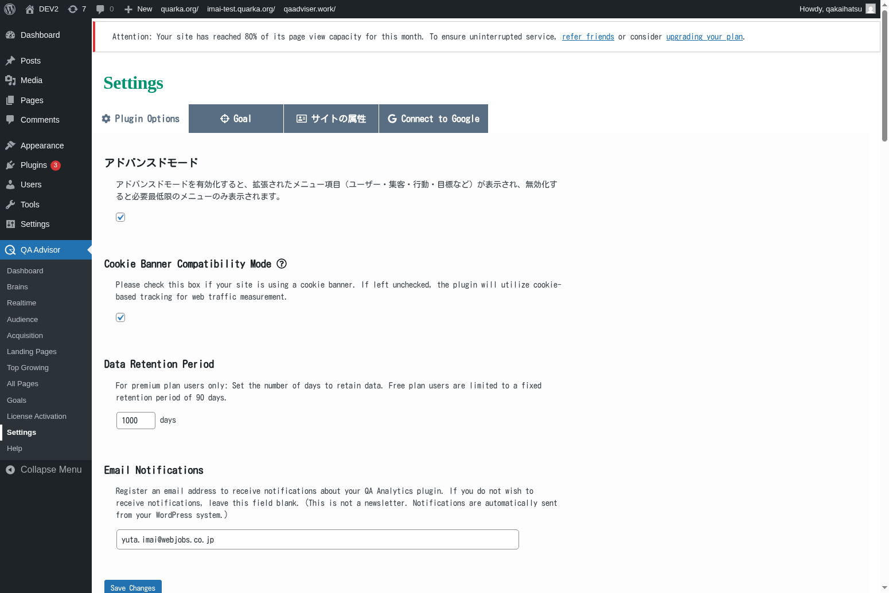

# Settings

## Overview
The Settings screen is the central configuration hub for the QA Advisor plugin, allowing you to customize tracking behavior, privacy settings, data collection preferences, and integration options. This section provides comprehensive control over how the plugin operates on your website and what data it collects.

## Accessing This Screen
1. Log in to your WordPress admin panel
2. Navigate to the left sidebar menu
3. Click on "QA Advisor"
4. Select "Settings" from the submenu

## Screen Layout

The Settings screen is organized into several configuration sections:
- **General Settings**: Basic plugin configuration and site information
- **Tracking Settings**: Data collection and analytics preferences
- **Privacy Settings**: GDPR compliance and user privacy controls
- **Integration Settings**: Third-party service connections and API configurations
- **Advanced Settings**: Technical configuration options for experienced users
- **Data Management**: Import, export, and data retention settings

## Features and Functions

### General Configuration
- **Purpose**: Configure basic plugin settings and site identification
- **How to use**: Set your site name, timezone, and basic tracking preferences
- **Options**: Site identification, default date ranges, and display preferences
- **Tips**: Ensure timezone settings match your business location for accurate reporting

### Tracking Configuration
- **Purpose**: Control what data is collected and how it's processed
- **How to use**: Enable or disable specific tracking features based on your needs
- **Options**: Page views, user interactions, conversion tracking, and custom events
- **Tips**: Balance comprehensive tracking with site performance and privacy requirements

### Privacy and Compliance
- **Purpose**: Ensure compliance with privacy regulations like GDPR and CCPA
- **How to use**: Configure consent management, data anonymization, and user rights
- **Options**: Cookie consent, IP anonymization, data retention periods, and user opt-out
- **Tips**: Regularly review privacy settings to maintain compliance with evolving regulations

### Third-party Integrations
- **Purpose**: Connect QA Advisor with other tools and services
- **How to use**: Configure API connections, data sharing, and external service integrations
- **Options**: Google Analytics, social media platforms, email marketing tools, and CRM systems
- **Tips**: Only enable integrations you actively use to minimize data sharing and complexity

## Common Tasks

### Initial Plugin Setup
1. Access the Settings screen after plugin installation
2. Configure basic site information and timezone settings
3. Set up tracking preferences based on your analytics needs
4. Configure privacy settings to comply with applicable regulations
5. Test tracking functionality to ensure proper operation

### Updating Privacy Settings
1. Review current privacy and compliance settings
2. Update consent management and data anonymization options
3. Configure data retention periods according to your privacy policy
4. Set up user opt-out mechanisms and data deletion procedures
5. Document changes for compliance records

### Configuring Integrations
1. Navigate to the Integration Settings section
2. Select the third-party services you want to connect
3. Enter API keys and authentication credentials
4. Configure data sharing preferences and sync settings
5. Test integrations to ensure proper data flow

### Performance Optimization
1. Review tracking settings for performance impact
2. Disable unnecessary tracking features to improve site speed
3. Configure data sampling for high-traffic sites
4. Optimize database settings and data retention policies
5. Monitor site performance after configuration changes

## Settings and Configuration

### Tracking Options
- Enable or disable specific tracking features (page views, events, conversions)
- Configure tracking code placement and loading behavior
- Set up custom event tracking and goal definitions
- Adjust data collection frequency and sampling rates

### Privacy Controls
- Configure cookie consent management and banner display
- Set up IP address anonymization and data pseudonymization
- Define data retention periods and automatic deletion schedules
- Enable user data access and deletion request handling

### Performance Settings
- Optimize tracking code loading and execution
- Configure database query optimization and caching
- Set up data archiving and storage management
- Adjust real-time processing and batch processing settings

### Integration Management
- Configure API connections and authentication methods
- Set up data synchronization schedules and preferences
- Manage webhook endpoints and data push notifications
- Control data sharing permissions and access levels

## Troubleshooting

### Tracking Not Working
- **Issue**: Analytics data is not being collected or appears incomplete
- **Solution**: Verify tracking code installation and check for JavaScript errors
- **Check**: Ensure tracking settings are properly configured and not blocked by ad blockers

### Privacy Compliance Issues
- **Issue**: Plugin may not be compliant with privacy regulations
- **Solution**: Review and update privacy settings, enable necessary consent mechanisms
- **Check**: Verify that data collection practices match your privacy policy

### Integration Failures
- **Issue**: Third-party integrations are not working or syncing data
- **Solution**: Check API credentials, connection settings, and service status
- **Check**: Verify that external services are operational and API limits are not exceeded

### Performance Problems
- **Issue**: Plugin is slowing down website loading or causing performance issues
- **Solution**: Optimize tracking settings, reduce data collection frequency, or enable caching
- **Check**: Monitor server resources and database performance after configuration changes

### Configuration Not Saving
- **Issue**: Settings changes are not being saved or are reverting to previous values
- **Solution**: Check file permissions, database connectivity, and browser cache
- **Check**: Verify that WordPress user has sufficient permissions to modify plugin settings

## Related Documentation
- [License Activation](/docs/user-manual/screens-and-operations/license-activation) - Manage plugin licensing and activation
- [Dashboard](/docs/user-manual/screens-and-operations/dashboard) - View the impact of settings changes on data collection
- [Goals](/docs/user-manual/screens-and-operations/goals) - Configure conversion tracking settings
- [Help](/docs/user-manual/screens-and-operations/help) - Get support for configuration issues
