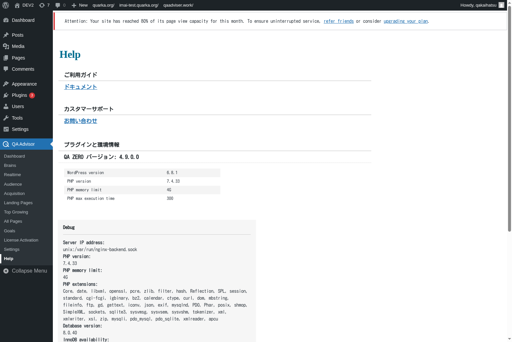

# Help

## Overview
The Help screen provides comprehensive support resources, documentation links, troubleshooting guides, and contact information for QA Advisor plugin assistance. This section serves as your first stop for resolving issues, learning about features, and accessing professional support when needed.

## Accessing This Screen
1. Log in to your WordPress admin panel
2. Navigate to the left sidebar menu
3. Click on "QA Advisor"
4. Select "Help" from the submenu

## Screen Layout

The Help screen includes:
- **Quick Start Guide**: Essential setup and configuration steps
- **Documentation Library**: Links to comprehensive user guides and tutorials
- **Troubleshooting Section**: Common issues and their solutions
- **Support Contact Options**: Ways to reach technical support
- **System Information**: Technical details about your installation
- **Community Resources**: Forums, knowledge base, and user community links

## Features and Functions

### Quick Start Guide
- **Purpose**: Provide immediate guidance for new users getting started with QA Advisor
- **How to use**: Follow the step-by-step instructions for initial setup and configuration
- **Options**: Basic setup, advanced configuration, and feature-specific guides
- **Tips**: Complete the quick start guide before exploring advanced features

### Documentation Access
- **Purpose**: Provide easy access to comprehensive documentation and tutorials
- **How to use**: Browse documentation categories or search for specific topics
- **Options**: User manual, developer documentation, API references, and video tutorials
- **Tips**: Bookmark frequently referenced documentation sections for quick access

### Troubleshooting Tools
- **Purpose**: Help diagnose and resolve common plugin issues
- **How to use**: Use diagnostic tools and follow troubleshooting guides for specific problems
- **Options**: Automated diagnostics, manual troubleshooting steps, and system checks
- **Tips**: Run diagnostics before contacting support to gather relevant information

### Support Contact Methods
- **Purpose**: Provide multiple ways to get help when self-service options aren't sufficient
- **How to use**: Choose the appropriate support channel based on your issue urgency and license type
- **Options**: Email support, live chat, phone support, and community forums
- **Tips**: Include system information and error details when contacting support

## Common Tasks

### Getting Started with QA Advisor
1. Access the Help screen and review the Quick Start Guide
2. Follow the initial setup instructions step by step
3. Configure basic tracking and privacy settings
4. Test the installation to ensure proper functionality
5. Explore additional features using the documentation links

### Troubleshooting Issues
1. Identify the specific problem you're experiencing
2. Check the troubleshooting section for relevant solutions
3. Run any available diagnostic tools
4. Follow the recommended troubleshooting steps
5. Contact support if the issue persists

### Learning Advanced Features
1. Browse the documentation library for feature-specific guides
2. Watch video tutorials for visual learning
3. Review best practices and optimization tips
4. Join community forums to learn from other users
5. Attend webinars or training sessions if available

### Contacting Support
1. Gather relevant information about your issue (error messages, system info, steps to reproduce)
2. Check your license type to determine available support options
3. Choose the appropriate contact method (email, chat, phone)
4. Provide detailed information about your problem
5. Follow up on support tickets and implement recommended solutions

## Settings and Configuration

### Help Preferences
- Customize which help resources are displayed prominently
- Set up notification preferences for new documentation and updates
- Configure language preferences for help content

### Diagnostic Settings
- Enable or disable automatic diagnostic data collection
- Configure system information sharing preferences
- Set up automated health checks and monitoring

### Support Integration
- Connect your support account for faster assistance
- Set up automatic ticket creation for critical issues
- Configure support notification preferences

## Troubleshooting

### Help Content Not Loading
- **Issue**: Help documentation or resources fail to load
- **Solution**: Check internet connection and firewall settings
- **Check**: Verify that external content loading is not blocked by security plugins

### Diagnostic Tools Not Working
- **Issue**: System diagnostic tools fail to run or provide incomplete information
- **Solution**: Check file permissions and PHP configuration
- **Check**: Ensure that diagnostic functions are not disabled by hosting restrictions

### Support Contact Issues
- **Issue**: Unable to reach support or submit support tickets
- **Solution**: Verify contact information and check spam filters
- **Check**: Ensure that your license is active and support is included

### Outdated Help Content
- **Issue**: Help documentation appears outdated or doesn't match current plugin version
- **Solution**: Clear browser cache and check for plugin updates
- **Check**: Verify that you're viewing documentation for the correct plugin version

### Search Function Not Working
- **Issue**: Help search functionality returns no results or incorrect information
- **Solution**: Try different search terms or browse categories manually
- **Check**: Ensure that search indexing is up to date and functioning properly

## Related Documentation
- [Settings](./11-settings.md) - Configure plugin settings and preferences
- [License Activation](./10-license-activation.md) - Manage licensing and support access
- [Dashboard](./01-dashboard.md) - Main plugin interface and overview
- External: Official QA Advisor documentation website
- External: Community forums and knowledge base
